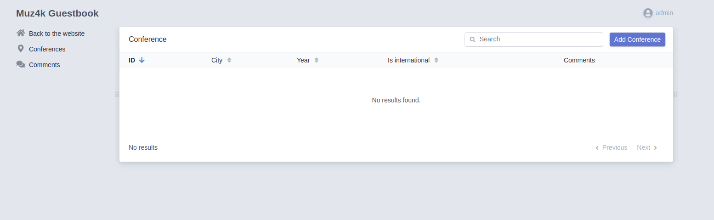

# guestbook
This is guestbook written Symfony 5 (with the help book "Symfony 5: Fast Track")

## Installation
Make sure you have all the necessary tools installed: git (he-he), composer, php, docker (docker-compose);

```   
git clone https://github.com/Muz4k/guestbook.git

composer install

docker-compose up -d

symfony console doctrine:migrations:migrate

npm install

symfony run yarn encore dev
```
That's All!

## Usage
Its empty guestbook

For added Conferences, you must have user with role admin.
Look!
```
symfony console security:encode-password

symfony run psql -c "INSERT INTO admin (id, username, roles, password) \
VALUES (nextval('admin_id_seq'), 'admin', '[\"ROLE_ADMIN\"]', \
'<password with eclipsed $>')"
```

For example password 1234:
'\$argon2id\$v=19\$m=65536,t=4,p=1\$S4cV3J9uN2JpCT7h8Qv52Q\$PLzTRKMY5qduS8VfMZ0t0KY1ApL78829WG6niZuzjwo'




After added Conferences, people will be able to add comments (after moderation through a configured mail client, of course).
Example:


Work in progress :)